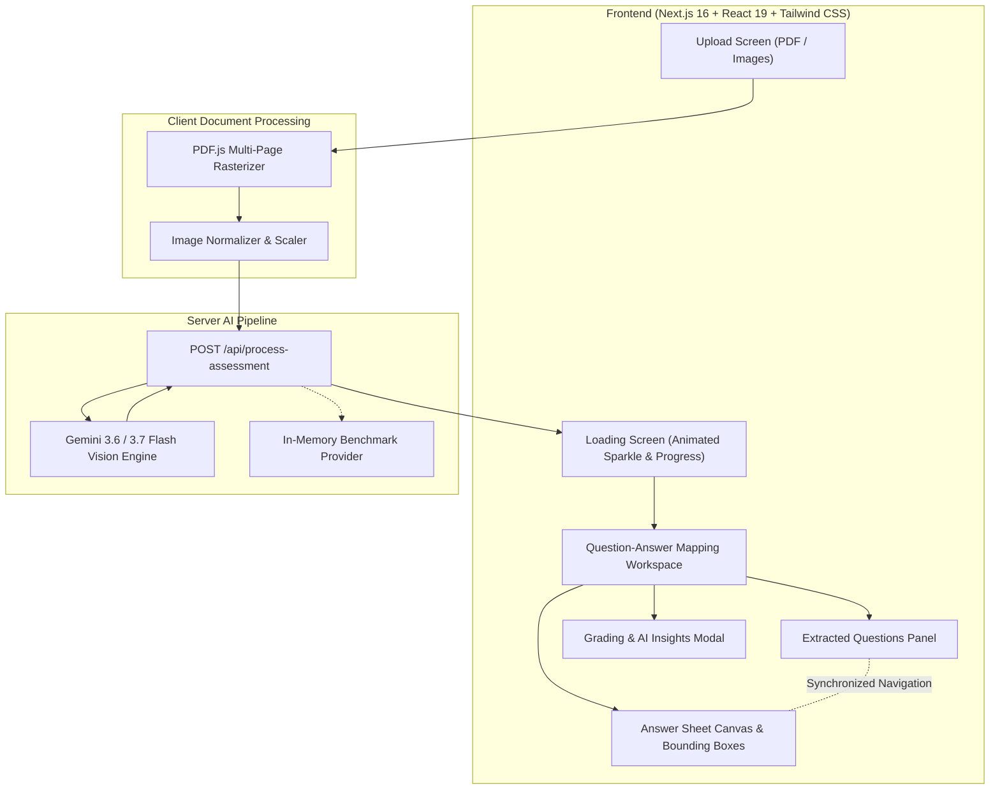

# VedaAI — AI Assessment Extraction & Answer Mapping Platform
## Comprehensive Architecture, Implementation & Execution Plan

---

### 1. Executive Summary & Problem Overview
The **VedaAI Assessment Extraction & Answer Mapping** system is an intelligent, high-fidelity web application tailored for educators. It automates the extraction of questions from test papers, transcribes and pinpoints student handwritten answers from answer sheets, maps answers to their respective questions with coordinate-level bounding box highlights, and delivers automated grading with actionable AI feedback.

This document details the end-to-end technical blueprint, design fidelity, data models, edge case strategies, AI processing pipeline, and verification roadmap.

---

### 2. Core Requirements & Evaluation Alignment

| Requirement Area | Specification | Implementation Strategy |
|---|---|---|
| **File Ingestion** | Upload Question Paper (PDF/Images) + Student Answer Sheet (PDF/Images) up to 10MB | Drag & drop dropzones, multi-page PDF rendering via `pdfjs-dist` to canvas/images, file preview metadata (pages, size, thumbnail). |
| **Question Extraction** | Extract all questions in printed order, preserve numbering, split sub-parts (e.g. `11 (a)` & `11 (b)`) | Multimodal LLM prompt with strict JSON schema enforcing parent question + sub-part separation, printed sequence indexing, and marks distribution. |
| **Answer Extraction & OCR** | Transcribe student handwriting, drawings, mathematical equations, and labeled diagrams | Multimodal Vision OCR parsing handwritten text, diagrams, and formulas with coordinate bounding boxes `[ymin, xmin, ymax, xmax]`. |
| **Answer Mapping** | Map each question to its corresponding answer regardless of ordering or structure | Contextual semantic matching + student question-header detection (`Q1`, `Ans 2`, `11(a)`) with fallback to semantic intent matching. |
| **Interactive Highlighting** | Clicking a question highlights and scrolls to the exact region on the answer sheet; clicking an answer box selects the question | Two-way reactive state binding: synced scroll target coordinates, SVG/Canvas bounding box overlay with animated glowing green borders and floating `Q#` badges. |
| **Multi-page Answers** | Support answers spanning across multiple pages | Array of bounding boxes per question: `[{ page: 1, box: [y1,x1,y2,x2] }, { page: 2, box: [y3,x3,y4,x4] }]` with cross-page navigation controls. |
| **Edge Cases** | Out-of-order answers, unanswered questions, extra/unmatched student writing | Explicit status categorization (`ANSWERED`, `UNANSWERED`, `OUT_OF_ORDER`, `UNMATCHED`), visual alert pills, and unmatched answers drawer. |
| **Grading & AI Feedback** | Marks calculation, correctness status, per-question feedback & overall exam summary | Dynamic scoring badges (`2/2`, `4/5`, `0/2`), collapsible AI Feedback accordions, and comprehensive teacher insights modal. |
| **Design Fidelity** | Pixel-perfect alignment with Figma references (Desktop & Mobile) | Strict adherence to VedaAI design tokens, floating AI toolkit pill, Delhi Public School branding, loading sparkle animation, and mobile segmented toggle. |
| **Live Evaluation Ready** | Immediate evaluator demo + live file upload with custom API key or built-in models | Built-in realistic mock sample datasets (matching Figma Biology test) + live Gemini models (3.6 / 3.5 Flash) multimodal API processing. |

---

### 3. Application Architecture & Data Flow



---

### 4. Detailed Data Schema & Type Definitions

```typescript
export interface BoundingBox {
  pageNumber: number; // 1-indexed page
  ymin: number; // Normalized coordinate (0 to 1000 or 0 to 100%)
  xmin: number;
  ymax: number;
  xmax: number;
  label?: string; // e.g. "Q2", "11a"
}

export type QuestionStatus = 'ANSWERED' | 'UNANSWERED' | 'OUT_OF_ORDER' | 'PARTIAL';
export type EvaluationStatus = 'CORRECT' | 'PARTIALLY_CORRECT' | 'INCORRECT' | 'NOT_ATTEMPTED';

export interface QuestionEntry {
  id: string; // e.g. "q-1", "q-11-a", "q-11-b"
  questionNumber: string; // "1", "2", "11"
  subPart?: string; // "a", "b", "i", "ii" (null if main question)
  fullLabel: string; // "1", "2", "11 a.", "11 b."
  printedOrder: number; // 1, 2, 3, ...
  questionText: string;
  maxMarks: number;
  awardedMarks: number;
  status: QuestionStatus;
  evaluation: EvaluationStatus;
  aiFeedback: string;
  keyConcepts?: string[];
  suggestedImprovement?: string;
  matchedAnswer?: {
    answerText: string;
    pageNumbers: number[];
    boundingBoxes: BoundingBox[];
    isMultiPage: boolean;
    confidenceScore: number;
    detectedHeader?: string; // e.g. "Ans 2.", "Q2"
  };
}

export interface UnmatchedAnswer {
  id: string;
  pageNumber: number;
  boundingBox: BoundingBox;
  transcribedText: string;
  aiNote: string;
}

export interface AssessmentResult {
  assessmentId: string;
  title: string;
  subject: string;
  gradeLevel: string;
  studentName?: string;
  totalPages: number;
  pageImages: string[]; // High-res image data URLs of answer sheet pages
  questionPaperImages?: string[];
  questions: QuestionEntry[];
  unmatchedAnswers: UnmatchedAnswer[];
  summary: {
    totalMarks: number;
    maxMarks: number;
    percentage: number;
    answeredCount: number;
    unansweredCount: number;
    totalQuestions: number;
    overallFeedback: string;
    strengths: string[];
    weaknesses: string[];
    teacherRecommendation: string;
  };
}
```

---

### 5. UI/UX Design Specifications (Matching Figma Exactly)

#### 5.1 Design Tokens & Color Palette
- **Backgrounds**: Light neutral canvas `#F8F9FA` with glassmorphic cards `#FFFFFF` and soft subtle borders `#E5E7EB`.
- **Primary Brand**: Charcoal `#1F242F` with vibrant Orange accent `#FF5722` / `#FF6B35`.
- **Badge Highlights**:
  - Selected Question Card: `#FFF7ED` fill, `#FF6B35` border (2px), active orange number badge.
  - Success Marks (`2/2`, `5/5`): Light emerald pill `#DCFCE7`, emerald text `#16A34A`.
  - Amber Marks (`3/5`, `4/5`): Light amber pill `#FEF3C7`, amber text `#D97706`.
  - Red / Unanswered Marks (`0/2`, `1/3`): Light rose pill `#FEE2E2`, rose text `#DC2626`.
- **Bounding Box Overlay**:
  - Active Answer: Emerald green bounding rectangle `#22C55E` with translucent green wash `rgba(34, 197, 94, 0.12)`, rounded corners (8px), floating top-left badge `Q2` with green fill `#22C55E` and crisp white text.
  - Hover / Secondary Answers: Subtle dashed outline with soft badge.
  - Unmatched Student Answers: Purple/Amber warning bounding box `#A855F7` with "Unmatched" badge.

#### 5.2 Component Breakdown
1. **Sidebar Navigation**:
   - **Expanded Mode (Upload Screen)**: Logo ("VedaAI"), "✨ AI Teacher's Toolkit" button with glow, navigation items (Home, My Classroom, Assignments, Exams [Active], My Library, Settings), Delhi Public School Bokaro Steel City crest and organization name at bottom.
   - **Collapsed Mode (Loading & Mapping Screens)**: Slim 64px width, icon-only layout with tooltip hover, school crest avatar, expand toggle `>>`.
2. **Top Header**:
   - Back button `<-`, Document title `[Exams Icon] Exams`, Help icon `?`, Notification bell with unread red dot, AI Sparkle icon, User Avatar + "Madhur Rastogi" with dropdown arrow.
3. **Upload Screen**:
   - Title: "Upload **Question Paper & Answer Sheets**" (with orange highlight container).
   - Orbiting 3D Teacher avatar illustration with animated satellite icons.
   - 2 Dotted Upload Cards: "Upload Question Paper" & "Upload Answer Sheet" (with drag-and-drop, PDF/image acceptance, file size indicator, quick removal `(x)`, and page count).
   - "Start Mapping ->" primary pill button (disabled state until both files are ready).
   - Quick Demo Bar: "Or test with preloaded Class 10 Biology Exam Sample" for instant 1-click evaluation.
4. **Loading State Screen**:
   - Centered 4-pointed orange animated star sparkle with subtle rotation and breathing pulse.
   - "Extracting..." bold heading + "This may take a while" subtext.
   - Interactive 4-step progress tracker:
     1. Ingesting & rendering document pages
     2. Extracting printed questions and sub-parts
     3. Detecting handwritten answers & bounding boxes
     4. Mapping & generating AI grading insights
5. **Question - Answer Mapping Screen (Split View)**:
   - **Left Panel (Extracted Questions)**:
     - Header: "Extracted Questions (from question paper)" + "Expand All / Collapse All" toggle.
     - Filter chips: All (`14`), Answered (`13`), Unanswered (`1`), Out of Order (`2`).
     - Question Cards: Number badge, question text, score pill, expandable chevron, active state orange glow, collapsible AI Feedback with praise and actionable correction notes.
     - Distinct sub-parts: `11 a.` and `11 b.` rendered as individual distinct cards.
   - **Right Panel (Answer Sheet Viewer)**:
     - Header: "Answer Sheet", Zoom toolbar (`- 100% +`, Fit-to-page), Page Navigator (`< Page 1 of 4 >`).
     - Interactive high-res canvas/image viewer with overlay SVG layer for bounding boxes.
     - Smooth scrolling to selected question's bounding box coordinates upon click.
     - Resizable divider handle between panels.
   - **Mobile Responsive Layout**:
     - Sticky top segmented control: `[Questions | Answer Sheet]` with smooth sliding indicator.
     - Floating quick-jump badge when on Answer Sheet to switch back to current question.
6. **Grading Summary & AI Insights Modal**:
   - Score breakdown card: Total marks (e.g. 38/45), percentage (84.4%), mastery rating.
   - Student performance analysis: Key strengths (e.g. "Accurate Photosynthesis diagrams"), Areas for improvement (e.g. "Heart blood flow pathway missing").
   - Export options: Download JSON report, Print Teacher Grading Sheet.

---

### 6. Edge Case Handling Strategy

| Edge Case Scenario | Detection & Handling Mechanism | User Experience |
|---|---|---|
| **Sub-parts `11(a)` & `11(b)`** | Prompt schema enforces parsing sub-parts as separate array entries with `parentQuestion: "11"`, `subPart: "a"`, `fullLabel: "11 a."`. | Rendered as separate sequential question cards with distinct badges and individual score pills. |
| **Out-of-Order Answers** | AI records detected question number and actual page/vertical coordinate. If order differs from printed sequence, tagged as `isOutOfOrder: true`. | Visual tag `Out of Order (Page 3)` on question card; clicking immediately navigates the right viewer to Page 3 and highlights the box. |
| **Unanswered Questions** | If no matching handwritten text/diagram exists, marked as `status: 'UNANSWERED'`, `awardedMarks: 0`. | Red/Gray `0/2 • Unanswered` badge; clicking shows banner: *"No matching answer detected on the student answer sheet."* with option to manually flag. |
| **Unmatched Student Answers** | Student wrote extra notes or an unrecognized question (e.g. "Q14 extra answer"). Bounding box is extracted but question ID is `null`. | Highlighted on sheet in purple/amber outline; listed under collapsible "Unmatched Answers (1)" badge in the question header. |
| **Multi-page Answers** | Student starts an answer at the bottom of Page 2 and finishes at the top of Page 3. AI outputs bounding boxes for both pages. | UI highlights box on Page 2 and Page 3; navigation provides *"Jump to continuation (Page 3)"* button. |
| **Poor Handwriting / Faded Scans** | Confidence score tracked per answer; fallback to semantic context if question labels are missing or illegible. | AI indicates confidence level and highlights the most probable region. |

---

### 7. Step-by-Step Implementation Plan

```
Phase 1: Project Setup & Core Foundation
├── [x] Initialize Next.js 16 (Turbopack, TypeScript, Tailwind CSS v4, ESLint)
├── [x] Install dependencies: lucide-react, framer-motion, clsx, tailwind-merge, @google/generative-ai, canvas-confetti, pdfjs-dist
├── [x] Setup Tailwind color tokens, typography (Geist/Inter font), and global CSS utility styles
└── [x] Create TypeScript types and mock data models (`src/types/assessment.ts`)

Phase 2: UI Shell & Navigation Components
├── [x] Sidebar Component (`src/components/layout/Sidebar.tsx`): Expanded & Collapsed modes, DPS School badge, AI Toolkit button
├── [x] Header Component (`src/components/layout/Header.tsx`): Breadcrumbs, avatar, notifications, AI sparkle, mobile menu button
└── [x] Layout wrapper with responsive mobile drawer support

Phase 3: Upload & Processing State
├── [x] Upload Screen (`src/components/upload/UploadScreen.tsx`): Dotted dropzones, file drag & drop, file preview cards, 3D teacher badge
├── [x] Preloaded Demo Sample Loader (1-click load for Class 10 Biology Test matching Figma)
└── [x] Animated Loading Screen (`src/components/processing/LoadingScreen.tsx`): Rotating 4-star sparkle, progress bar & stage steps

Phase 4: Client-side Document Rendering & PDF Engine
├── [x] PDF / Image Canvas Engine (`src/components/viewer/DocumentCanvas.tsx`): High-res multi-page rendering, zoom controls, fit-to-width
└── [x] SVG Coordinate Bounding Box Overlay (`src/components/viewer/BoundingBoxOverlay.tsx`): Normalized coordinate mapping, green bounding boxes, Q# pills, click/hover handlers

Phase 5: Question-Answer Mapping & Split View
├── [x] Split View Container (`src/components/mapping/MappingView.tsx`) with draggable resizer divider & keyboard shortcuts
├── [x] Extracted Questions List (`src/components/mapping/QuestionsList.tsx`): Number badges, score pills, sub-part support (`11 a.`, `11 b.`), filter tabs, expand/collapse all
├── [x] Question Card with Collapsible AI Feedback accordion (`src/components/mapping/QuestionCard.tsx`)
├── [x] Two-way synchronization: Click question -> scroll & highlight answer; click answer -> highlight question
└── [x] Mobile View Toggle (`src/components/mapping/MobileMappingView.tsx`): `[Questions | Answer Sheet]` segmented switch with floating quick-jump bar

Phase 6: AI Extraction & Mapping Backend Pipeline
├── [x] Server Route `/api/process-assessment`: Ingests question paper & answer sheet images
├── [x] Gemini Models (`gemini-3.6-flash`, `gemini-3.5-flash`, `gemini-3.5-flash-lite`) Multimodal integration with structured JSON schema output
├── [x] Coordinate normalization & bounding box calculator
└── [x] Fallback in-memory smart engine for zero-config offline / mock execution

Phase 7: Grading Insights & Edge Case Polish
├── [x] Overall Grading Summary Modal (`src/components/grading/GradingSummaryModal.tsx`) with score chart, strengths, areas to improve, and report export
├── [x] Unmatched Answers Drawer & Unanswered Question Banners
├── [x] API Key configuration modal (allows entering personal Google Gemini key or using default)
└── [x] Production build validation and deployment readiness
```

---

### 8. Verification & Quality Assurance Strategy

1. **Visual Accuracy & Figma Fidelity**:
   - Compare side-by-side with all 9 Figma reference screens (desktop empty, desktop filled, desktop loading, desktop mapping, mobile empty, mobile filled, mobile loading, mobile question toggle, mobile answer toggle).
   - Ensure typography, border radii, badge colors, and spacing are 100% faithful to the reference images.
2. **Interactive Testing**:
   - Verify clicking every question card (Q1 through Q13, including 11a and 11b) immediately scrolls the answer viewer to the exact page and coordinate.
   - Verify zoom in (`+`), zoom out (`-`), reset (`100%`), and page navigation (`< Page X of Y >`).
   - Verify mobile toggle transitions smoothly between Questions and Answer Sheet.
3. **Edge Case Verification**:
   - Test sub-part parsing (`11 a.` and `11 b.` as distinct items).
   - Test out-of-order navigation (e.g. Q2 before Q1).
   - Test unanswered question handling (Q4 marked as unanswered with clear alert).
   - Test unmatched answer highlights.
4. **Build & Live Deployment Validation**:
   - Run `npm run build` with zero TypeScript or lint errors.
   - Ensure app runs seamlessly in development and production bundles.
   - Ready for one-click deployment to Vercel / Netlify with public live URL.
