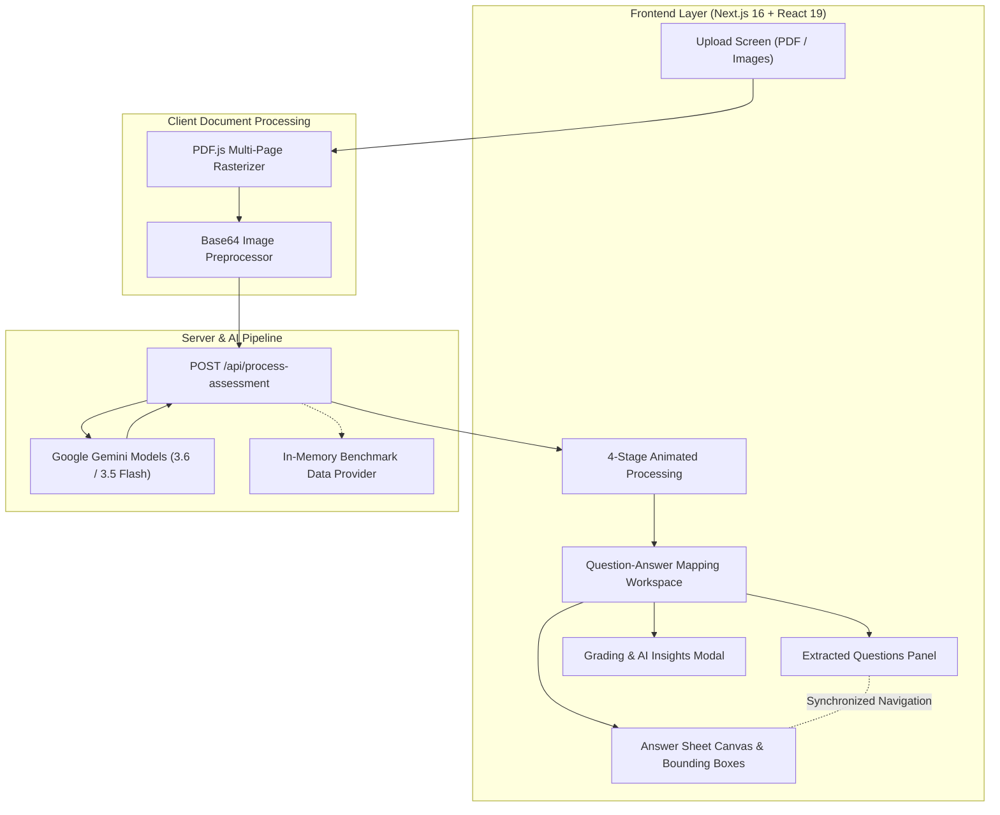

# VedaAI — AI Assessment Extraction & Answer Mapping Platform

[](https://nextjs.org/)
[](https://react.dev/)
[](https://www.typescriptlang.org/)
[](https://tailwindcss.com/)
[](https://aistudio.google.com/)

> **VedaAI** is an intelligent assessment extraction, handwritten answer mapping, and automated grading platform built for educators. It automates printed question extraction from question papers, performs OCR transcription on student handwritten answer sheets, maps answers to questions with coordinate-level glowing bounding boxes, and generates rubric-aligned grading with constructive AI feedback.

---

## 📑 Table of Contents

1. [Executive Overview](#-executive-overview)
2. [Key Features](#-key-features)
3. [Architecture & Technical Stack](#-architecture--technical-stack)
4. [File & Directory Structure](#-file--directory-structure)
5. [End-to-End Workflow](#-end-to-end-workflow)
6. [Edge Case Handling](#-edge-case-handling)
7. [API Reference](#-api-reference)
8. [Data Models & Type Definitions](#-data-models--type-definitions)
9. [UI/UX Design System & Tokens](#-uiux-design-system--tokens)
10. [Getting Started & Installation](#-getting-started--installation)
11. [Environment Variables](#-environment-variables)
12. [Evaluation & Demo Walkthrough](#-evaluation--demo-walkthrough)
13. [Scripts & Commands](#-scripts--commands)

---

## 🌟 Executive Overview

Manual grading of handwritten school assessments is tedious, error-prone, and time-consuming. Teachers spend hours cross-referencing printed question papers against student answer booklets.

**VedaAI** solves this by bridging printed assessments and student handwritten submissions using **Multimodal AI Vision**:
- **Automatic Ingestion**: Uploads multi-page PDFs or image scans of Question Papers and Student Answer Sheets.
- **Hierarchical Extraction**: Parses printed questions in sequence, splitting parent questions and sub-parts (e.g. `11 (a)` and `11 (b)`).
- **Handwriting OCR & Bounding Boxes**: Detects student handwriting, mathematical equations, and labeled biological/scientific diagrams, pinpointing their exact `[ymin, xmin, ymax, xmax]` normalized coordinates.
- **Two-Way Synced Mapping**: Split-view UI where clicking a question highlights and scrolls to its answer on the answer sheet, and clicking a bounding box selects the corresponding question.
- **Pedagogical AI Feedback**: Grades each question against maximum marks, identifies strengths/weaknesses, and computes holistic student performance analytics.

---

## ✨ Key Features

### 1. 📂 Dual Document Upload & PDF Engine
- **Supported Formats**: Multi-page PDF files and images (`PNG`, `JPG`, `JPEG`, `WEBP`) up to 10MB.
- **Client-side PDF Rendering**: High-resolution page rendering via `pdfjs-dist` to HTML5 Canvas / JPEG data URLs.
- **Drag & Drop Dropzones**: Visual drag states, file metadata preview (name, formatted size, page count), and quick remove `(X)`.
- **1-Click Benchmark Demo**: Instant sample loader (Class 10 Biology Exam matching Figma references) with pre-parsed questions, multi-page handwritten answers, and AI insights.

### 2. ⚡ Animated 4-Stage Ingestion Pipeline
- Custom 4-pointed rotating glowing star sparkle animation (`SparkleAnimation.tsx`).
- Real-time progress bar with step-by-step pipeline status:
  1. *Document Ingestion & Multi-page Rendering*
  2. *Extracting Question Paper & Sub-parts (11a, 11b)*
  3. *OCR Transcribing Handwriting & Coordinate Bounding Boxes*
  4. *Synthesizing AI Marks & Pedagogical Feedback*

### 3. 🎯 Two-Way Interactive Split Viewer
- **Left Panel (Extracted Questions)**:
  - Filter chips: **All**, **Answered**, **Unanswered**, and **Out of Order**.
  - Dynamic score pills (`2/2` green, `3/5` amber, `0/2` red).
  - Sub-part separation (`11 a.` and `11 b.` as distinct, addressable cards).
  - Collapsible **AI Feedback** accordion detailing constructive praise, conceptual analysis, and suggested improvements.
  - Global *Expand All / Collapse All* controls.
- **Right Panel (Answer Sheet Canvas & Bounding Box Overlay)**:
  - Normalized SVG/CSS coordinate overlay with glowing emerald borders (`#22C55E`) and floating `Q#` badges.
  - Zoom controls: Zoom In (`+`), Zoom Out (`-`), Reset (`100%`), and Fit-to-page.
  - Multi-page navigation toolbar (`< Page X of Y >`) with rapid page jumping.
  - Smooth programmatic scroll centering when a question card is selected.
  - Clickable bounding boxes to select questions directly from the document sheet.
  - Resizable split-pane divider.

### 4. 📱 Full Responsive & Mobile Optimization
- **Mobile Segmented Toggle**: Smooth sliding `[ Questions | Answer Sheet ]` switch.
- **Floating Quick-Jump Pill**: When reviewing the Answer Sheet on mobile, a floating badge allows instant navigation back to the active question card.
- Responsive slide-out navigation drawer with Delhi Public School (DPS) branding.

### 5. 📊 Grading Summary & AI Insights Modal
- **Comprehensive Scorecard**: Total marks scored, percentage, mastery ratings, and celebratory confetti animation (`canvas-confetti`).
- **Student Performance Analysis**: Key strengths (e.g. *"Clear diagrams for Photosynthesis"*) and areas for improvement (e.g. *"Missing coronary blood flow steps"*).
- **Pedagogical Action Plan**: AI teacher recommendations for personalized remedial instruction.
- **Export & Print**:
  - Download structured JSON report (`<StudentName>_Grading_Report.json`).
  - Print / Save as PDF teacher grading sheet (`window.print()`).

### 6. 🛠️ AI Teacher's Toolkit & Configuration
- **Teacher's Toolkit Modal (`TeacherToolkitModal.tsx`)**:
  - Grading Strictness Slider (Level 1 to 5).
  - Automated Sub-part Splitting toggle (`11a`, `11b`).
  - Diagram & Scientific Equation OCR toggles.
  - Step marking and rubric configuration settings.
  - Batch classroom grading workflows.
- **In-App API Key Modal (`ApiKeyModal.tsx`)**:
  - Enter custom Google Gemini API Key directly in the UI without restarting servers.
  - Keys are securely saved in `localStorage` (`veda_gemini_api_key`).

---

## 🏗️ Architecture & Technical Stack



### Core Technologies:
| Layer | Technology | Details |
|---|---|---|
| **Framework** | Next.js 16 (App Router) | High-performance React framework with Turbopack and Server Routes |
| **UI Library** | React 19 | Modern component model with Client & Server Component separation |
| **Language** | TypeScript 5 | Strict typing across data models, bounding boxes, and API schemas |
| **Styling** | Tailwind CSS v4 & PostCSS | Custom design tokens, glassmorphic utilities, and layout grids |
| **Icons & Motion** | `lucide-react`, `framer-motion` | Crisp iconography and smooth UI transitions |
| **PDF Processing** | `pdfjs-dist` | Multi-page client-side PDF rasterization to canvas/image buffers |
| **AI Vision Engine** | `@google/generative-ai` | Multimodal evaluation via models: `gemini-3.6-flash`, `gemini-3.5-flash`, `gemini-3.5-flash-lite` |
| **Celebration** | `canvas-confetti` | Confetti fireworks on grading score celebration |

---

## 📁 File & Directory Structure

```
veda-ai/
├── .env.example                       # Environment variable template
├── .env.local                         # Local environment config (GEMINI_API_KEY)
├── figma-references/                  # Reference screenshots from Figma
│   ├── Upload Screen - Empty State.png
│   ├── Upload Screen - filled state.png
│   ├── Loading state.png
│   ├── Question - Answer mapping screen (desktop).png
│   └── ... (mobile variants)
├── public/                            # Static assets and SVG icons
├── src/
│   ├── app/
│   │   ├── api/
│   │   │   └── process-assessment/
│   │   │       └── route.ts           # Gemini Multimodal API route handler
│   │   ├── favicon.ico                # App favicon
│   │   ├── globals.css                # Global CSS styles and Tailwind setup
│   │   ├── layout.tsx                 # Root HTML layout with Geist font
│   │   └── page.tsx                   # Main state machine & orchestrator
│   ├── components/
│   │   ├── grading/
│   │   │   └── GradingSummaryModal.tsx # Score summary, analytics, export JSON & print
│   │   ├── icons/
│   │   │   ├── SparkleAnimation.tsx   # 4-pointed rotating glowing orange sparkle
│   │   │   ├── TeacherIllustration.tsx # 3D orbiting teacher avatar illustration
│   │   │   └── VedaLogo.tsx           # VedaAI official brand logo
│   │   ├── layout/
│   │   │   ├── Header.tsx             # Breadcrumbs, score badge, API key trigger, profile
│   │   │   └── Sidebar.tsx            # Expandable/collapsible navigation with DPS crest
│   │   ├── mapping/
│   │   │   ├── MappingView.tsx        # Desktop resizable split-pane container
│   │   │   ├── MobileMappingView.tsx  # Mobile view with segmented toggle & jump pill
│   │   │   ├── QuestionCard.tsx       # Individual question card with AI feedback
│   │   │   └── QuestionsList.tsx      # Extracted questions panel with filter tabs
│   │   ├── processing/
│   │   │   └── LoadingScreen.tsx      # 4-stage animated loading screen
│   │   ├── settings/
│   │   │   └── ApiKeyModal.tsx        # Gemini API Key configuration modal
│   │   ├── toolkit/
│   │   │   └── TeacherToolkitModal.tsx # Grading strictness, rubric & batch options
│   │   ├── upload/
│   │   │   └── UploadScreen.tsx       # Dual dropzones, file preview, demo loader
│   │   └── viewer/
│   │       ├── AnswerSheetViewer.tsx  # Canvas container, zoom bar, page navigator
│   │       ├── BoundingBoxOverlay.tsx # Normalized coordinate SVG bounding box layer
│   │       └── DocumentCanvas.tsx     # High-resolution answer sheet image renderer
│   ├── lib/
│   │   ├── file-converter.ts          # PDF to high-res page image rasterizer
│   │   ├── mock-data.ts               # Complete Class 10 Biology benchmark dataset
│   │   └── utils.ts                   # Class merging (cn), formatters & coordinate math
│   └── types/
│       └── assessment.ts              # TypeScript models, BoundingBox, QuestionEntry, etc.
├── package.json                       # Project dependencies & scripts
├── tsconfig.json                      # TypeScript configuration
└── README.md                          # Comprehensive project documentation
```

---

## 🔄 End-to-End Workflow

```
1. File Selection / 1-Click Demo
   ├── User drags & drops Question Paper + Answer Sheet (or clicks "Test with Sample")
   └── PDF.js rasterizes all document pages into high-res data URLs on the client.
         ↓
2. Processing & Multimodal Analysis
   ├── Page displays 4-stage loading animation with rotating star sparkle.
   ├── Next.js route `/api/process-assessment` receives images.
   └── Google Gemini extracts questions, splits subparts (11a/11b), runs OCR,
       detects normalized coordinates [ymin, xmin, ymax, xmax], and scores answers.
         ↓
3. Interactive Split-Screen Mapping
   ├── Left: Filterable questions list with marks badges and collapsible AI feedback.
   ├── Right: Answer sheet canvas with green bounding box overlays & Q# badges.
   └── Selecting any question automatically scrolls to its answer coordinates on the sheet.
         ↓
4. Evaluation & Export
   ├── Teacher reviews AI score suggestions, key concepts, and actionable improvements.
   └── Teacher opens Grading Modal to view mastery rating, export JSON report, or print.
```

---

## 🛡️ Edge Case Handling

| Edge Case Scenario | Detection & Handling Strategy | User Experience |
|---|---|---|
| **Sub-parts (`11 a.` & `11 b.`)** | Schema enforces separation into distinct entries with `parentQuestion: "11"`, `subPart: "a" / "b"`, and `fullLabel: "11 a."`. | Rendered as separate sequential cards with individual score pills and distinct bounding box coordinates. |
| **Out-of-Order Answers** | Identified when question number sequence on the answer sheet diverges from printed paper order. | Marked with an amber `Answered on Page X` pill; clicking automatically navigates to that page and centers the box. |
| **Unanswered Questions** | Flagged when no student handwriting matches the question (`status: "UNANSWERED"`, `awardedMarks: 0`). | Displayed with a red `0/2 • Unanswered` badge and an alert message explaining no answer was detected. |
| **Multi-page Answers** | Generated as multiple bounding boxes across different page numbers (`pageNumbers: [2, 3]`). | Highlighted across both pages with a blue `Spans Pages 2, 3` badge and navigation jump buttons. |
| **Unmatched Student Notes** | Extracted handwritten notes/rough work not tied to any question in the paper. | Outlined with a purple/amber warning box on the answer sheet and cataloged under unmatched notes. |

---

## 📡 API Reference

### `POST /api/process-assessment`

Ingests question paper and answer sheet page images, runs Gemini multimodal vision analysis with automatic model fallback, and returns structured mapping results.

#### Supported Gemini Models & Fallback Hierarchy
The API endpoint iteratively evaluates requests against a model pipeline with strict JSON schema output (`responseMimeType: "application/json"`):
1. **`gemini-3.6-flash`** — Primary high-intelligence multimodal model for question segmentation and complex diagram OCR.
2. **`gemini-3.5-flash`** — High-speed fallback model for balanced transcription and bounding box detection.
3. **`gemini-3.5-flash-lite`** — Lightweight fallback ensuring robust uptime and low-latency grading synthesis.

#### Request Body
```json
{
  "questionPaperImages": ["data:image/jpeg;base64,..."],
  "answerSheetImages": ["data:image/jpeg;base64,..."],
  "apiKey": "AIzaSy...",
  "isDemo": false
}
```

#### Response Body (`200 OK`)
```json
{
  "success": true,
  "data": {
    "assessmentId": "asm-bio-101",
    "title": "Class 10 Biology Unit Test — Life Processes & Genetics",
    "subject": "Biology",
    "gradeLevel": "Class 10",
    "studentName": "Aarav Sharma",
    "totalPages": 4,
    "pageImages": [
      { "pageNumber": 1, "imageUrl": "data:image/jpeg;base64,...", "width": 800, "height": 1100 }
    ],
    "questions": [
      {
        "id": "q-1",
        "questionNumber": "1",
        "subPart": null,
        "fullLabel": "1",
        "printedOrder": 1,
        "questionText": "What is the primary function of stomata in plant leaves?",
        "maxMarks": 2,
        "awardedMarks": 2,
        "status": "ANSWERED",
        "evaluation": "CORRECT",
        "aiFeedback": "Accurate definition covering gaseous exchange and transpiration.",
        "keyConcepts": ["Transpiration", "Gas Exchange", "Guard Cells"],
        "matchedAnswer": {
          "answerText": "Stomata are tiny pores present on the epidermis of leaves...",
          "pageNumbers": [1],
          "isMultiPage": false,
          "confidenceScore": 0.96,
          "detectedHeader": "Q1.",
          "boundingBoxes": [
            { "pageNumber": 1, "ymin": 95, "xmin": 65, "ymax": 185, "xmax": 735, "label": "Q1" }
          ]
        }
      }
    ],
    "unmatchedAnswers": [],
    "summary": {
      "totalMarks": 38,
      "maxMarks": 45,
      "percentage": 84.4,
      "answeredCount": 13,
      "unansweredCount": 1,
      "outOfOrderCount": 1,
      "totalQuestions": 14,
      "overallFeedback": "Strong understanding of Life Processes with well-labeled diagrams.",
      "strengths": ["Clear diagrams for Photosynthesis", "Accurate nephron explanation"],
      "weaknesses": ["Incomplete double circulation explanation"],
      "teacherRecommendation": "Provide targeted practice on human circulatory pathways."
    }
  }
}
```

---

## 📐 Data Models & Type Definitions

The complete data contracts are defined in [`src/types/assessment.ts`](file:///c:/Users/neera/Documents/Visual%20Studio%20Code/job%20assessments/veda-ai/src/types/assessment.ts):

```typescript
export interface BoundingBox {
  pageNumber: number; // 1-indexed page (1, 2, 3, 4)
  ymin: number;       // Normalized coordinate (0-1000)
  xmin: number;
  ymax: number;
  xmax: number;
  label?: string;     // e.g. "Q1", "11 a.", "11 b."
}

export type QuestionStatus = 'ANSWERED' | 'UNANSWERED' | 'OUT_OF_ORDER' | 'PARTIAL';
export type EvaluationStatus = 'CORRECT' | 'PARTIALLY_CORRECT' | 'INCORRECT' | 'NOT_ATTEMPTED';

export interface QuestionEntry {
  id: string;
  questionNumber: string;
  subPart?: string;
  fullLabel: string;
  printedOrder: number;
  questionText: string;
  maxMarks: number;
  awardedMarks: number;
  status: QuestionStatus;
  evaluation: EvaluationStatus;
  aiFeedback: string;
  isOutOfOrder?: boolean;
  actualAnswerPage?: number;
  keyConcepts?: string[];
  suggestedImprovement?: string;
  matchedAnswer?: {
    answerText: string;
    pageNumbers: number[];
    boundingBoxes: BoundingBox[];
    isMultiPage: boolean;
    confidenceScore: number;
    detectedHeader?: string;
  };
}
```

---

## 🎨 UI/UX Design System & Tokens

Adheres strictly to the VedaAI brand identity and Figma specifications:

- **Primary Colors**:
  - Brand Dark: `#1E242D` / `#1F242F`
  - Brand Orange Accent: `#FF5722` / `#FF6B35`
  - Canvas Background: `#F8F9FA`
- **Bounding Box Aesthetics**:
  - Outline: 2px solid `#22C55E` (Emerald Green)
  - Fill: `rgba(34, 197, 94, 0.10)`
  - Active Label: `#22C55E` rounded badge with bold white text
- **Marks Badges**:
  - High / Full Marks (`2/2`, `5/5`): `bg-emerald-50 text-emerald-600 border-emerald-200`
  - Partial Marks (`3/5`, `4/5`): `bg-amber-50 text-amber-600 border-amber-200`
  - Zero / Unanswered (`0/2`): `bg-red-50 text-red-600 border-red-200`
- **Typography**:
  - Geist / Inter sans-serif typeface with clear hierarchy (`text-xs`, `text-sm`, `text-base`, `text-lg`).

---

## 🚀 Getting Started & Installation

### Prerequisites
- **Node.js**: `v18.18.0` or later (Node 20+ recommended)
- **npm**, **yarn**, or **pnpm**

### Step 1: Clone the Repository
```bash
git clone https://github.com/ny1411/veda-ai-asssessment.git
cd veda-ai
```

### Step 2: Install Dependencies
```bash
npm install
```

### Step 3: Configure Environment Variables
Copy `.env.example` to `.env.local`:
```bash
cp .env.example .env.local
```

Edit `.env.local` and add your Google Gemini API key:
```env
GEMINI_API_KEY=your_gemini_api_key_here
```
> *(Optional)*: You can also launch the app without an `.env.local` file and enter your API key directly inside the app using the **API Key** button in the header.

### Step 4: Run the Development Server
```bash
npm run dev
```

Open [http://localhost:3000](http://localhost:3000) in your browser.

---

## 🔑 Environment Variables

| Variable | Description | Required | Default |
|---|---|---|---|
| `GEMINI_API_KEY` | Google Gemini API Key for Multimodal Vision Assessment processing | Optional (can be configured in UI or test with built-in Demo mode) | `undefined` |

To obtain a Gemini API key:
1. Visit [Google AI Studio](https://aistudio.google.com/app/apikey).
2. Create or select a project and generate a new API key.
3. Add it to `.env.local` or enter it into the app via the in-browser modal.

---

## 🧪 Evaluation & Demo Walkthrough

Follow these steps to experience every feature in the application:

1. **Instant Demo Launch**:
   - On the upload screen, click **"Or test with preloaded Class 10 Biology Exam Sample"**.
   - Notice the document cards populate automatically (`Class_10_biology_unit_test.pdf` and `student_1_answer_sheet.pdf`).
   - Click the orange **"Start Mapping ->"** button.

2. **Loading Experience**:
   - Watch the animated 4-pointed orange star sparkle and 4-step progress tracker.

3. **Explore Interactive Mapping**:
   - Click question **1** (`Q1`): The right viewer scrolls to Page 1 and highlights the stomata definition.
   - Click question **2** (`Q2`): Notice the highlighted photosynthesis diagram and chemical equation.
   - Click sub-part **11 a.** and **11 b.**: See how subparts are split and mapped independently.
   - Click question **13** (Out of order): Notice the amber tag `Answered on Page 3` — the viewer navigates to Page 3.
   - Click question **4** (Unanswered): Notice the red `0/2 • Unanswered` badge and warning banner.

4. **Answer-to-Question Reverse Click**:
   - Click directly on any green bounding box in the right answer sheet — the left panel scrolls to and activates that exact question card.

5. **Grading & AI Insights**:
   - Click the **Score: 38/45 (84%)** badge in the top header.
   - Review the student report card, confetti celebration, key strengths, and areas for improvement.
   - Click **"Export JSON"** to download the structured grading report.
   - Click **"Print Report"** to open the browser print sheet.

6. **Custom Live File Processing**:
   - Click the back arrow `<-` to return to the Upload screen.
   - Drag and drop your own Question Paper and Answer Sheet files (PDF or Images).
   - Ensure your Gemini API Key is configured via the **API Key** header button.
   - Click **"Start Mapping ->"** to run live multimodal AI grading.

---

## 📜 Scripts & Commands

| Command | Description |
|---|---|
| `npm run dev` | Starts the Next.js Turbopack development server on `http://localhost:3000` |
| `npm run build` | Builds the optimized production application |
| `npm run start` | Runs the compiled production build |
| `npm run lint` | Runs ESLint to verify code quality and style conventions |

---

## 👥 Author & Assessment Information

- **Project**: VedaAI Assessment Extraction & Answer Mapping Platform
- **Repository**: `ny1411/veda-ai-asssessment`
- **Assessment Scope**: AI Question Extraction, Handwriting OCR, Bounding Box Mapping, Multi-page Navigation, Sub-part Handling & Pedagogical Grading.
